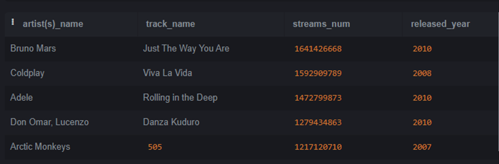

# AnalisisSpotifySQL
ANÁLISIS CANCIONES MÁS ESCUCHADAS SPOTIFY CON SQLITE
Se lleva a cabo el análisis del siguiente dataset: https://www.kaggle.com/datasets/nelgiriyewithana/top-spotify-songs-2023.
Resolveré las siguientes preguntas con SQLite 
1.- ¿Cuál ha sido la canción y artista más escuchado  y el que menos?
El cantante más escuchado ha sido The Weekend con la canción ‘Blinding Lights’

 
El cantante menos escuchado ha sido Carin Leon, Grupo Frontera con la canción ‘Que vuelvas’
 

2.- ¿Y quién fue más escuchado entre 2000 y 2010?
En esta década fue más escuchado Eminen con ‘Lose Yourself’ ,lanzada en 2002
 

3. ¿Cuáles fueron las 5 canciones más escuchadas antes del 2000? ¿Y cuáles entre 2005 y 2010?

Las más escuchadas antes del 2000
 
 
Y entre 2005 y 2010

 
 
5. ¿En que mes se escucha más música de 2022?
   
Se escucho más música en Mayo de 2022

 

7. ¿Cuántas canciones tiene Miley Cyrus, Bad Bunny y Taylor Swift?
   
 
 
9. ¿Qué porcentaje de discursos tienen las 5 canciones más escuchadas y las que menos?
Las más escuchadas tienen un porcentaje de discurso en la canción de:

 
 
Y las que menos:
 

7. Muéstrame las 10 canciones más escuchadas y dime en cuantas playlists están? ¿Y las que menos?
   
Las más escuchadas:

 
 
Las que menos:

 
 
Aquí podemos ver que aquellas más escuchadas si que están en más playlist que las menos escuchadas. Sin embargo, en cada grupo ser más escuchada no significa estar en más playlist que el resto.

9. Créame una columna nueva en la que se clasifiquen las canciones según el número de escuchadas. Las que superen 2000000000 que aparezcan como ‘Super hit’, entre 800000 y 2000000000 ‘Mediocre’ y menos de 800000 ‘No muy buena’.
    

 
11. Quiero comparar la popularidad de las canciones de Taylor Swift y Bad Bunny. Muéstrame cuantas canciones tiene cada uno y la cantidad de veces que han escuchado esa canción.
Tras la consulta vemos que son más escuchadas las canciones de Bad Bunny.

 
 
13. ¿Cuántas veces han escuchado canciones que empiezan con Car’s Outside y dime en que mes y año salió la canción?
    
 

15. Que 10 canciones más escuchadas al menos tienen dos artistas.
    
 
 
17. Muéstrame el número de canciones que tiene aquellos, pero solo de aquellos que tengan más de 5 canciones.
    
 

19. En 2017 cual es la media de escuchas para cada artista (Solo 1 artista)
    
 

  
